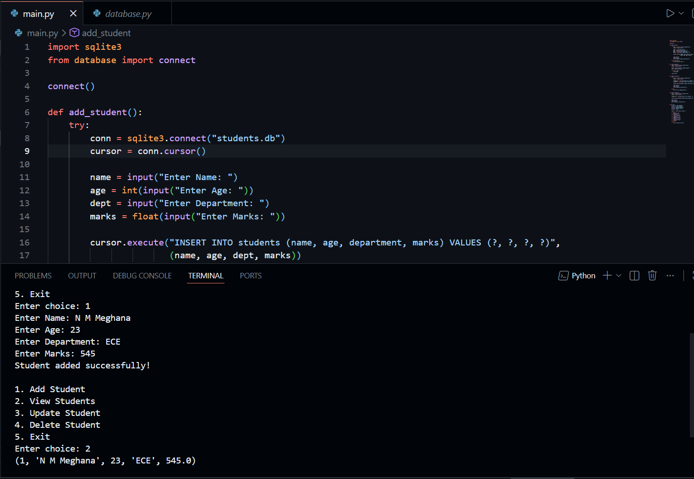

# Student Profile Management System

## Overview
A Python-based Student Profile Management System used to manage student records.

## Features
- Add Student
- View Student Details
- Update Student Information
- Delete Student Records

## Technologies Used
- Python
- SQLite

## Project Structure

Student_Management/
├── main.py
├── database.py

## Output

## How to Run

python main.py
